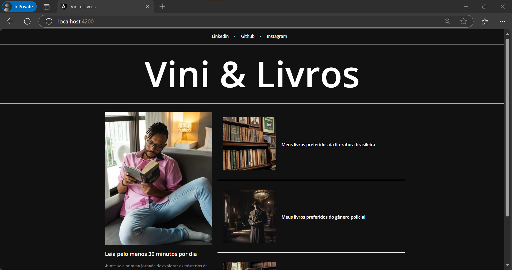
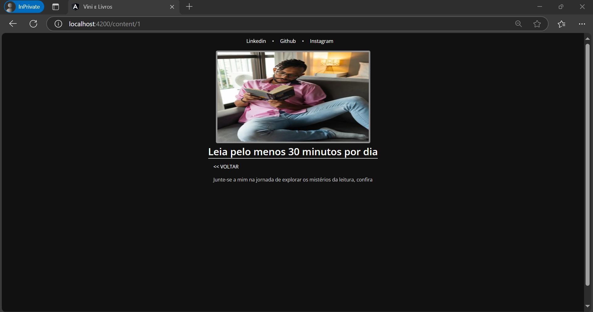
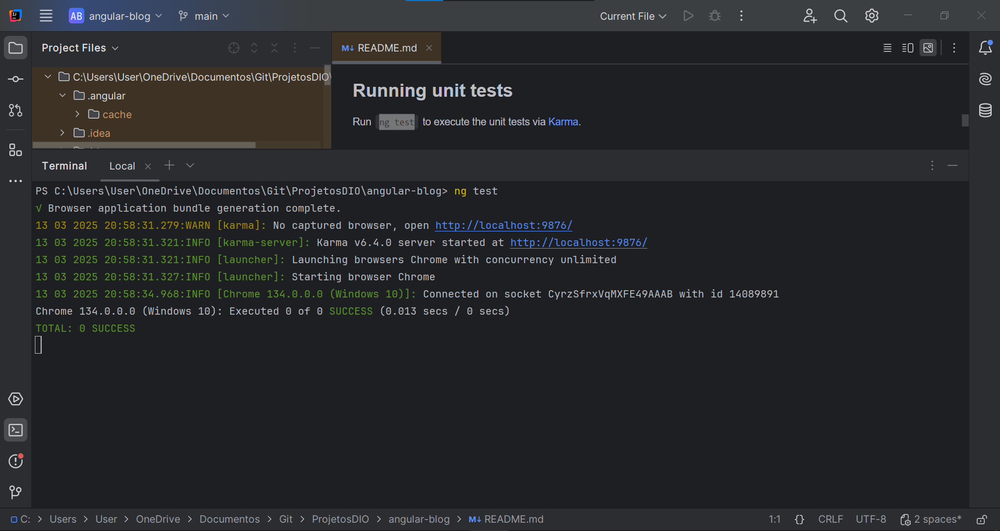
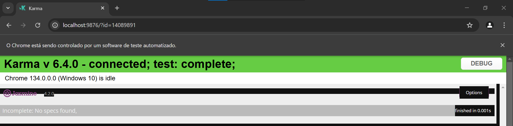

# Criando um Blog com Angular
<h1 align="center">
    
</h1>

## Descrição do Projeto

Este projeto é uma aplicação de um **blog** construída utilizando **Angular**. Foi gerado com o Angular CLI na versão 14.1.2. O objetivo principal foi criar uma plataforma simples de blog com funcionalidades essenciais como exibição de postagens e navegação entre as páginas. A aplicação também foi projetada para ser responsiva, garantindo que o layout se ajuste a diferentes dispositivos.

### 🎯 Objetivos do Projeto

Durante o desenvolvimento, enfrentei alguns desafios, incluindo:

- **Responsividade**: Implementar um design que fosse adaptável a dispositivos móveis e desktops. O uso do **Bootstrap** facilitou esse processo, mas ainda houve a necessidade de ajustes personalizados no CSS.

- **Roteamento entre páginas**: A aplicação exige uma navegação fluida entre as páginas. Configurar o roteamento de maneira eficiente para suportar múltiplas páginas de postagens foi um desafio, mas a utilização do **Angular Router** facilitou essa implementação.

O projeto é uma excelente base para quem deseja aprender mais sobre o **framework Angular** e suas práticas recomendadas.

---
## 🛠️ Tecnologias utilizadas (Pré-requisitos):

- Node.js
- Angular CLI
- Typescript
- HTML/CSS
---

## 📁 Estrutura do Projeto

Aqui está uma visão geral da estrutura de diretórios do projeto:

angular-blog/
├── src/
│   ├── app/               # Código-fonte da aplicação
│   ├── assets/            # Arquivos estáticos (imagens, fontes, etc.)
│   ├── environments/      # Configurações de ambiente
│   ├── favicon.ico        # Ícone do site
│   ├── index.html         # Página principal
│   ├── main.ts            # Arquivo principal para inicialização do Angular
│   ├── polyfills.ts       # Polyfills para suportar diferentes navegadores
│   └── styles.css         # Arquivo global de estilos CSS
└── angular.json           # Configurações do Angular CLI
---
 
## Funcionalidades Implementadas:

- Exibição de postagens: A aplicação exibe uma lista de postagens de forma dinâmica.
- Formulários de criação de postagens: Possibilidade de criar novas postagens através de um formulário simples.
- Roteamento: Navegação entre diferentes páginas de postagens e páginas do blog.
- Responsividade: O design da aplicação se adapta para diferentes dispositivos, garantindo uma boa experiência de uso em qualquer tela.

---

## 🖼️ Imagens do Blog

Aqui você pode adicionar capturas de tela ou imagens do seu blog em funcionamento. Exemplo:

#### 1. **Tela Principal do Blog**
<h1 align="center">
    
</h1>

#### 2. **Página de Postagem**
<h1 align="center">
    
</h1>

#### 3. **Execução de Testes

<h1 align="center">
    
</h1>
<h1 align="center">
    
</h1>


## ⚙️ Como Gerar Componentes e Funcionalidades

Utilize o **Angular CLI** para gerar novos componentes, serviços ou outros artefatos:

- Para gerar um novo componente:
```bash
ng generate component nome-do-componente
```
- Para gerar um serviço:
ng generate service nome-do-serviço

- Para gerar um módulo:
ng generate module nome-do-modulo

## 🧪 Testes
Este projeto está configurado com testes unitários e de integração.

Testes Unitários
Para executar os testes unitários com Karma:
```
ng test
```
### Testes End-to-End
Para executar os testes end-to-end:
```
ng e2e
```
## 🛠️ Construção do Projeto
Para construir o projeto para produção, execute o seguinte comando:
```
ng build
```
## 🏁 Conclusão
Este projeto foi uma excelente oportunidade para praticar o uso do Angular e entender melhor sua arquitetura, incluindo como configurar rotas, criar componentes e gerenciar estado com RxJS. Embora tenha enfrentado desafios ao lidar com a responsividade e a integração do roteamento, o processo foi uma excelente forma de aprimorar minhas habilidades e aprender novas abordagens para problemas comuns em desenvolvimento web.

Com a implementação do blog, consegui integrar todos os conceitos de desenvolvimento front-end que são essenciais em muitas aplicações modernas, como design responsivo, interatividade com o usuário e boas práticas de codificação. Ao final, o projeto é uma boa base para evoluir para um sistema mais complexo no futuro.

